  

  
  
  
  
  

  

  
  

---

## ⚡ About Me

  

As a B.Tech Computer Science student, I am passionate about bridging the gap between data-driven machine learning algorithms and intuitive user experiences. My core focus revolves around **Python programming**, **modern frontend web design**, and **intelligent AI/ML architectures**, engineering solutions that are both technically robust and visually compelling.

I actively champion **prompt engineering** and **vibe coding** to dramatically accelerate full-stack development cycles and construct smart, agile solutions.

- 🔭 **Current Focus:** Building AI-driven systems including **ResuSmart**, **AAPDA-MITRA**, and a custom **Voice Assistant**.
- 🌱 **Continuous Learning:** Exploring deep learning architectures, Large Language Models (LLMs), and scalable web APIs.
- 💡 **Tech Philosophy:** Combining cutting-edge AI assistance with clean code principles to solve real-world problems.
- 🤝 **Open to Collaborate:** Available for AI/ML projects, intuitive UI/UX design, and innovative software initiatives.
- ⚡ **Off-Screen:** When I'm not writing code, you'll find me analyzing suspense mystery films, diving into military documentaries, or rewatching the classic movie, *Anand*.

 

---

## 🚀 Featured Projects Showcase

  <table>
    <tr>
      <th align="center">Project</th>
      <th align="left">Description</th>
      <th align="center">Tech Stack</th>
      <th align="center">Explore</th>
    </tr>
    <tr>
      <td align="center"><b>🎯 ResuSmart</b></td>
      <td>Smart resume analysis and skill-matching engine that scores resumes against target job descriptions with actionable feedback.</td>
      <td align="center"><code>Python</code> • <code>Streamlit</code> • <code>NLP</code> • <code>Scikit-Learn</code></td>
      <td align="center"></td>
    </tr>
    <tr>
      <td align="center"><b>🚨 AAPDA-MITRA</b></td>
      <td>Intelligent disaster preparedness and emergency response coordination portal delivering real-time alerts and resource allocation.</td>
      <td align="center"><code>Python</code> • <code>FastAPI</code> • <code>Data Analytics</code> • <code>AI Logic</code></td>
      <td align="center"></td>
    </tr>
    <tr>
      <td align="center"><b>🎙️ Voice Assistant</b></td>
      <td>Hands-free desktop voice assistant capable of automated web browsing, system control, task scheduling, and conversational queries.</td>
      <td align="center"><code>Python</code> • <code>SpeechRecognition</code> • <code>pyttsx3</code> • <code>Automation</code></td>
      <td align="center"></td>
    </tr>
  </table>

---

##  Tech Stack &amp; Developer Arsenal 

  

  <!-- Animated Live Skills Stream -->
  

    
  

<!-- TECH_STACK_START -->

  <h4 align="center">
    
    Artificial Intelligence, Machine Learning &amp; Data Science
  </h4>
  <table align="center">
    <tr>
      <td align="center" width="108">
        
         <b>PyTorch</b>
      </td>
      <td align="center" width="108">
        
         <b>TensorFlow</b>
      </td>
      <td align="center" width="108">
        
         <b>Scikit-learn</b>
      </td>
      <td align="center" width="108">
        
         <b>XGBoost</b>
      </td>
      <td align="center" width="108">
        
         <b>Keras</b>
      </td>
    </tr>
    <tr>
      <td align="center" width="108">
        
         <b>Pandas</b>
      </td>
      <td align="center" width="108">
        
         <b>NumPy</b>
      </td>
      <td align="center" width="108">
        
         <b>Seaborn</b>
      </td>
      <td align="center" width="108">
        
         <b>OpenCV</b>
      </td>
      <td align="center" width="108">
        
         <b>Jupyter</b>
      </td>
    </tr>
  </table>

  <h4 align="center">
    
    Programming Languages &amp; Modern Web Architecture
  </h4>
  <table align="center">
    <tr>
      <td align="center" width="108">
        
         <b>Python</b>
      </td>
      <td align="center" width="108">
        
         <b>Java</b>
      </td>
      <td align="center" width="108">
        
         <b>C</b>
      </td>
      <td align="center" width="108">
        
         <b>JavaScript</b>
      </td>
      <td align="center" width="108">
        
         <b>HTML5</b>
      </td>
      <td align="center" width="108">
        
         <b>CSS3</b>
      </td>
      <td align="center" width="108">
        
         <b>FastAPI</b>
      </td>
      <td align="center" width="108">
        
         <b>Streamlit</b>
      </td>
    </tr>
  </table>

  <h4 align="center">
    
    Cloud, DevOps &amp; Developer Workflow
  </h4>
  <table align="center">
    <tr>
      <td align="center" width="108">
        
         <b>Git</b>
      </td>
      <td align="center" width="108">
        
         <b>GitHub</b>
      </td>
      <td align="center" width="108">
        
         <b>Docker</b>
      </td>
      <td align="center" width="108">
        
         <b>VS Code</b>
      </td>
      <td align="center" width="108">
        
         <b>MySQL</b>
      </td>
      <td align="center" width="108">
        
         <b>PowerShell</b>
      </td>
      <td align="center" width="108">
        
         <b>AI / Prompts</b>
      </td>
    </tr>
  </table>

<!-- TECH_STACK_END -->

---

## 📊 GitHub Analytics & Code Activity

  
  

  

  

---

## 🐍 Contribution Activity Snake

  

---

## 🏆 Certifications & Achievements

  
<b>Click to expand / collapse certificates</b>

   
  <table>
    <tr>
      <th align="left">Certification / Program</th>
      <th align="left">Issuing Organization</th>
      <th align="center">Credential Badge</th>
    </tr>
    <tr>
      <td><b>AI-Machine Learning Engineer Certificate Course</b></td>
      <td>Reliance Foundation Skilling Academy</td>
      <td align="center"></td>
    </tr>
    <tr>
      <td><b>Artificial Intelligence &amp; Machine Learning</b></td>
      <td>C-DAC (Centre for Development of Advanced Computing)</td>
      <td align="center"></td>
    </tr>
    <tr>
      <td><b>Python Essentials 1</b></td>
      <td>Cisco Networking Academy</td>
      <td align="center"></td>
    </tr>
    <tr>
      <td><b>TCS iON Career Edge - Young Professional</b></td>
      <td>Tata Consultancy Services (TCS iON)</td>
      <td align="center"></td>
    </tr>
    <tr>
      <td><b>TCS iON Career Edge - IT Primer</b></td>
      <td>Tata Consultancy Services (TCS iON)</td>
      <td align="center"></td>
    </tr>
  </table>

---

## 💡 Developer Laugh & Inspiration

  

  

---

## 📬 Let's Connect!

  
  &nbsp;
  
  &nbsp;
  
  &nbsp;
  

  

